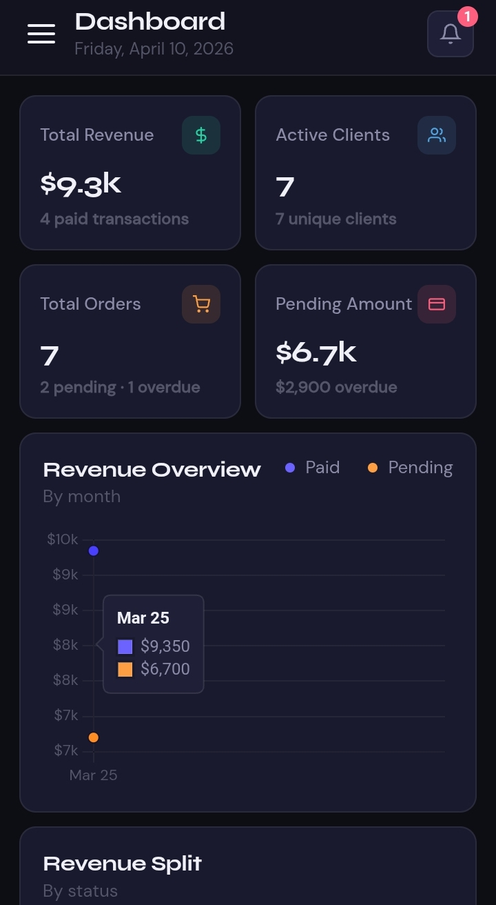
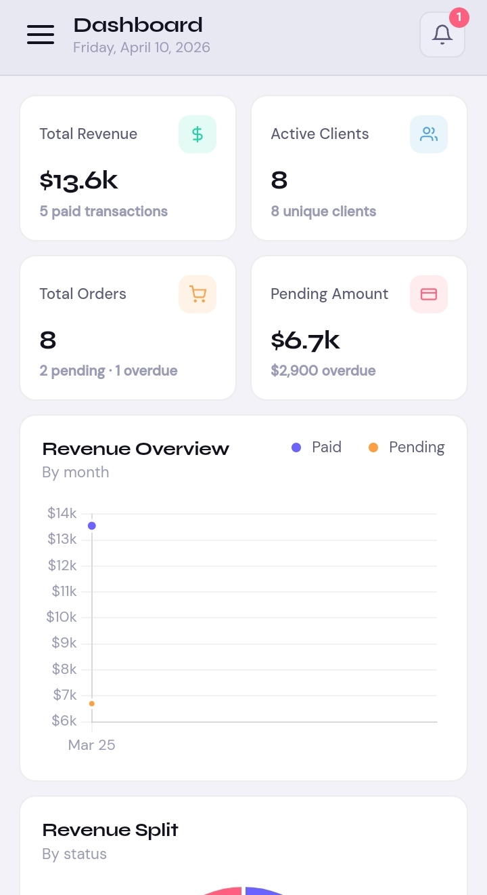
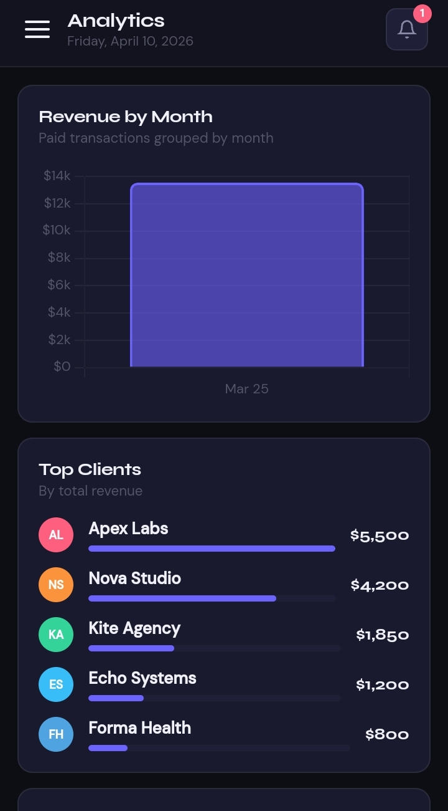
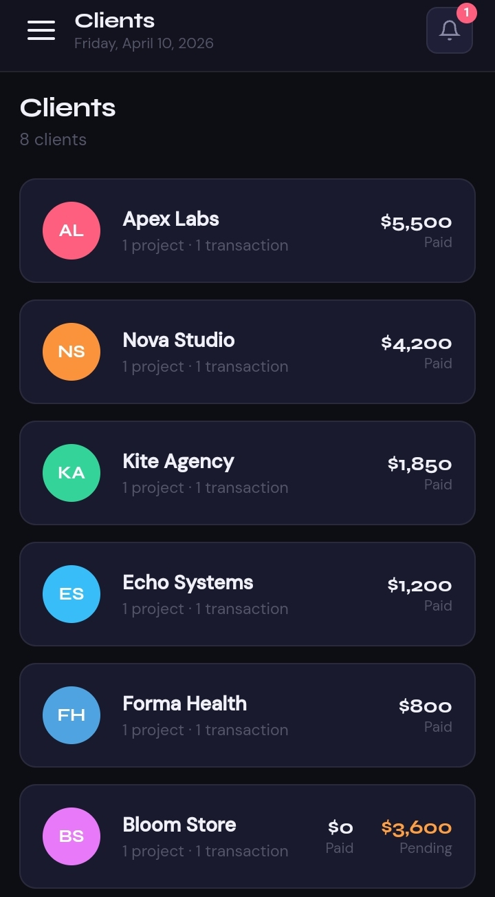
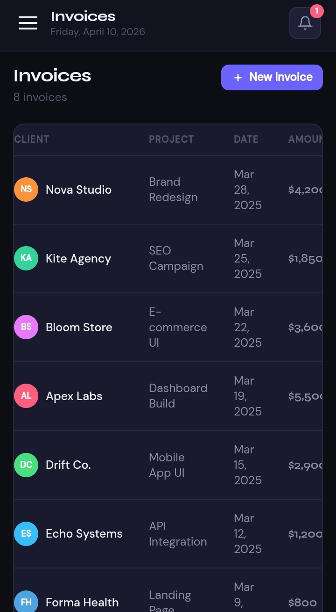
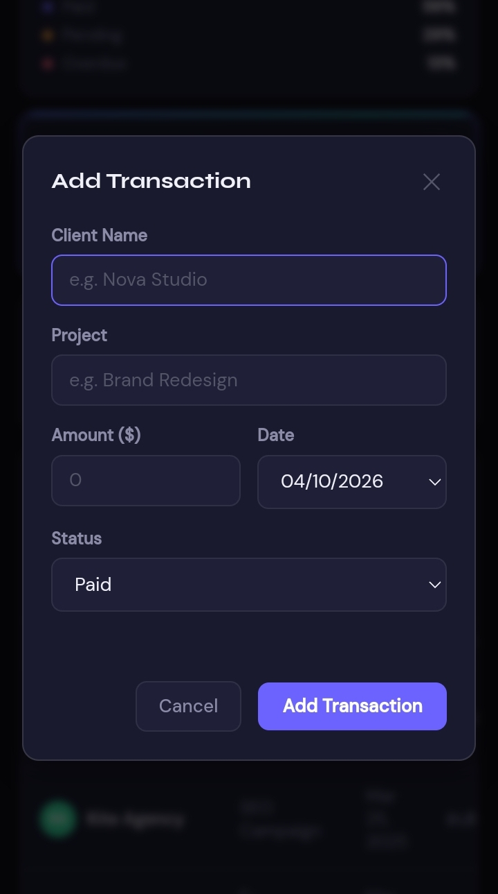

# Pulse — SaaS Business Dashboard

> A fully interactive business analytics dashboard built with vanilla HTML, CSS, and JavaScript. No frameworks. No build tools. Just clean, intentional code.

**[Live Demo →](https://feyisara-o.github.io/pulse-dashboard/)**

---



---

## The Problem

Freelancers, small business owners, and early-stage startups typically track their business performance across spreadsheets, invoices, and disconnected tools. There's no single place that gives them a clear, real-time view of how their business is doing.

The result is guesswork — decisions made without clarity.

---

## The Solution

Pulse is a business intelligence dashboard that consolidates the metrics that matter most into one clean interface. Revenue, client count, pending invoices, overdue payments — all visible at a glance, with an AI layer that turns those numbers into a single actionable insight.

---

## Screenshots

| Dashboard — Dark Mode | Dashboard — Light Mode |
|---|---|
|  |  |

| Analytics Page | Clients Page |
|---|---|
|  |  |

| Invoices Page | Add Transaction Modal |
|---|---|
|  |  |

---

## Features

### Core Dashboard
- **4 live KPI cards** — Total Revenue, Active Clients, Total Orders, and Pending Amount — all calculated in real time from your transaction data
- **Revenue Overview chart** — Line chart comparing paid vs pending transactions grouped by month
- **Revenue Split chart** — Doughnut chart showing the breakdown of paid, pending, and overdue amounts
- **Monthly Goal tracker** — Animated progress bar tracking revenue against a user-defined target
- **Notification badge** — Automatically counts overdue transactions and surfaces them in the topbar

### Transactions
- **Add transactions** via a modal form — client name, project, amount, date, and status
- **Delete transactions** with a single click
- **Filter by status** — All, Paid, Pending, Overdue
- **Live search** — filters the table by client name or project as you type
- **Export to CSV** — download all transaction data as a spreadsheet
- **localStorage persistence** — data survives page refreshes and browser restarts

### AI Business Pulse
- Powered by the Claude API
- Reads live dashboard metrics — revenue, overdue clients, pending totals, goal progress
- Generates one concise, actionable business insight on load and on demand
- Typewriter animation for a polished feel
- Graceful fallback if the API is unavailable

### Analytics Page
- Bar chart of paid revenue grouped by month
- Top 5 clients ranked by total revenue with animated progress bars
- Payment health breakdown — paid, pending, and overdue totals with transaction counts

### Clients Page
- Auto-generated from transaction data — no manual entry needed
- Each client card shows total paid, total pending, project count, and transaction count
- Sorted by highest revenue client first

### Invoices Page
- Full transaction list with client, project, date, amount, and status
- **Mark as Paid** — update overdue or pending invoices with one click, instantly reflecting across the dashboard

### Settings Page
- Edit the monthly revenue goal target
- Toggle dark/light theme (synced with the sidebar toggle)
- Clear all transaction data with a confirmation prompt

---

## Tech Stack

| Technology | Role |
|---|---|
| HTML5 | Semantic page structure |
| CSS3 | Mobile-first layout, theming, animations |
| Vanilla JavaScript | All interactivity, data logic, API calls |
| Chart.js | Line, bar, and doughnut charts |
| Claude API | AI-powered business insights |
| localStorage | Client-side data persistence |

---

## Design Decisions

**No framework.** This project didn't need one. Vanilla JS keeps the codebase lean, fast, and genuinely readable. It also demonstrates solid fundamentals — a much stronger signal than spinning up a Create React App boilerplate.

**Mobile-first CSS.** Base styles are written for mobile. Complexity is added progressively with `min-width` media queries. This is the industry standard approach, not the exception.

**Data computed from transactions.** Every metric on the dashboard — revenue, client count, orders, pending amount — is calculated directly from the transaction array. There's no separate hardcoded data layer. Add a transaction and the entire dashboard updates.

**CDN dependencies.** Chart.js and Google Fonts load from CDN. Both are globally cached, production-grade, and faster than self-hosting for a project of this type.

**localStorage over a backend.** This is a frontend demonstration. In a production product, the transaction data would come from a backend API connected to a real database. localStorage provides a realistic "it works" experience without the overhead of a server.

---

## Project Structure

```
pulse-dashboard/
├── index.html        — Full page structure, all pages, modal
├── css/
│   └── style.css     — Mobile-first styles, theming, animations
└── js/
    └── app.js        — Data logic, rendering, API integration
```

---

## Running Locally

No installation required.

```bash
git clone https://github.com/your-username/pulse-dashboard.git
cd pulse-dashboard
open index.html
```

Or simply open `index.html` directly in any browser.

---

## What I Learned

- How to architect a multi-page single-file application without a router library
- How to compute derived state — building metrics from a single source of truth rather than maintaining separate data
- How to integrate a real AI API and handle loading states, errors, and fallbacks gracefully
- How to write mobile-first CSS that actually works across all device sizes
- How to use localStorage as a lightweight persistence layer for a frontend-only application

---

## Author

**Feyisara O.** — Frontend Developer

[Portfolio](https://feyisara-o.github.io/feyisara-porfolio/) · [LinkedIn](https://www.linkedin.com/in/mofeyisara-okunola-73121b277?utm_source=share_via&utm_content=profile&utm_medium=member_android) · [Upwork](https://upwork.com/your-profile)
